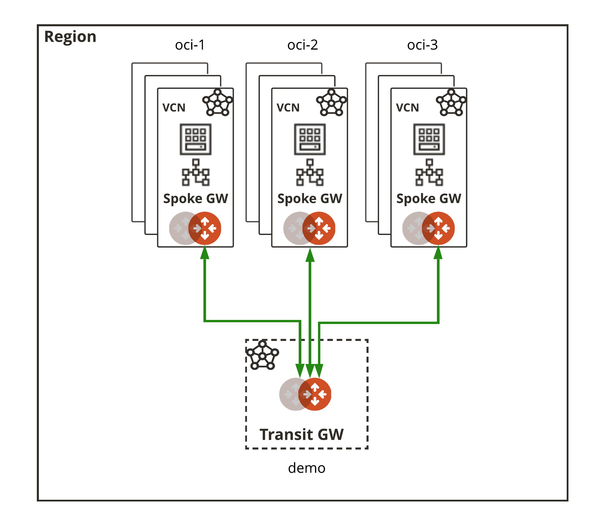

 

## South America Transit Demo 1

### Summary

This is a simple demonstration to show Aviatrix Transit in OCI. The example is simple, spokes could be in any region. Additional Transit Gateways could be launched in other regions (or clouds) if needed.

Scaling out the Aviatrix Transit infrastructure to 10s or 100s of spokes will be a function of the Compute limits associated with the target OCI tenancy.

### BOM

- 1 Aviatrix Transit VPC and gateway in OCI in 1 regions with 3 spoke gateways attached
- 3 Spoke VPCs and gateways in OCI attached to the Transit Gateway in the same region

### Diagram


  

### Prerequisites

- Software version requirements met
- Aviatrix Controller with Access Account defined for OCI 
- Sufficient limits in place for each region in scope (Compute quotas, etc.)
- terraform .12 in the user environment ```terraform -v```

### Workflow

- Modify ```terraform.tfvars.template``` _(i.e. access accounts, regions, cidrs, etc.)_ and **save the file as** ```terraform.tfvars```
- ```terraform init```
- ```terraform plan```
- ```terraform apply --auto-approve```

### Software Version Requirements

Component | Version
--- | ---
Aviatrix Controller | UserConnect-6.1.1280
Aviatrix Terraform Provider | 2.16.2
Terraform | 0.12

### Terraform Registry Modules

Module Name | Version | Description
:--- | :--- | :---
[terraform-aviatrix-modules/oci-transit/aviatrix](https://registry.terraform.io/modules/terraform-aviatrix-modules/oci-transit/aviatrix/1.1.0) | 1.1.0 | This module deploys a VPC and Aviatrix transit gateway
[terraform-aviatrix-modules/oci-spoke/aviatrix](https://registry.terraform.io/modules/terraform-aviatrix-modules/oci-spoke/aviatrix/1.1.0) | 1.1.0 | This module deploys a VPC and an Aviatrix spoke gateway in OCI and attaches it to an Aviatrix Transit Gateway


# multi_cloud_transit
# multi_cloud_transit
